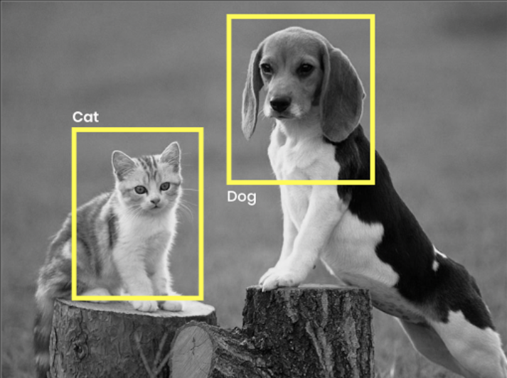
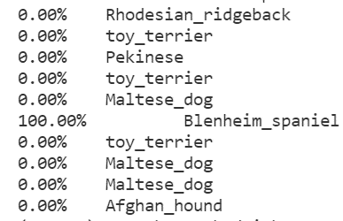

# P6_OCR_categorise_dog_pictures

    


# Breed classifier

This is a project to classify dogs breed from pictures.

## Setup

Use requirements.txt for the librairies

## Notice

Once you installed the librairies you will find the notebook in /notebook/ folder.
You can change in the variables cell the number of breed to train the classifier

The default model in /model/ folder is a 10 breeds trained.

To predict a dog breed use :
```bash
python classifier.py --path 'your image path'
```

## References

Dogs dataset :     [http://vision.stanford.edu/aditya86/ImageNetDogs/](http://vision.stanford.edu/aditya86/ImageNetDogs/)

## Results

The classifier will predict the breed of the dog.
